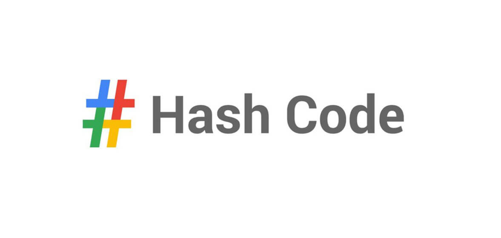

# Google-Hash-Code-2020-Practice
## More-Pizza 🍕
Written in Javascript (NodeJs)

### My Approach
1. create random generated sequences that the some of them are less than max pizza slices
2. execlude sequences that have sum above max pizza slices and create candidate solutions array
3. sort canidate solutions array by their sum in descending order 
4. most likely your first elemnt in this array have maximum pizza slices

### Score
Solution for the Practice Round of Google Hash Code 2020 - Score: 1,505,004,614 

| File | Score |
| ------ | ------ |
| a_example | 16 points  |
| b_small | 100 points  |
| c_medium | 4,500 points |
| d_quite_big | 999,999,998 points  |
| e_also_big |  505,000,000 points  |
| Total | 1,505,004,614 points |

